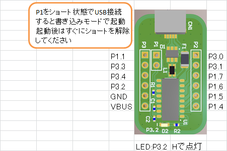

# CH551_Breakout_Board

## これは何？
WCH社製のUSBペリフェラル付きのマイコンCH551のブレイクアウトボードです．
WCHとは？CH551とは？については拙著のアドベントカレンダー記事の [こちら](https://tech-blog.cerevo.com/archives/6068/) を御覧ください．

## 回路図
[PDF](CH551_BB_sch.pdf)

## Pin map

## 開発環境の導入