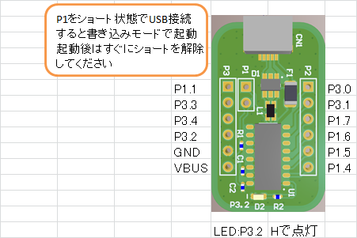
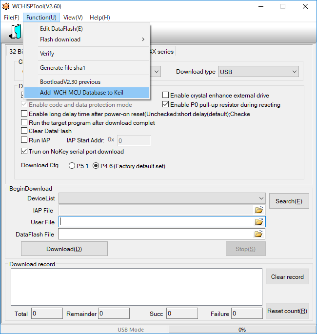

# CH551_Breakout_Board

## これは何？
WCH社製のUSBペリフェラル付きのマイコンであるCH551Gを搭載したブレイクアウトボードです．

WCHとは？CH551とは？については拙著のアドベントカレンダー記事の [こちら](https://tech-blog.cerevo.com/archives/6068/) を御覧ください．
また，デバイスの詳細についてはメーカの [製品ページ](http://www.wch.cn/products/CH551.html) を御覧ください．

デバイスの [データシート](http://www.wch.cn/download/CH552DS1_PDF.html) (CH551/552共通)は中国語ですが，雰囲気で読めます．

若しくは，はくらさん([@hakura_riku](https://twitter.com/hakura_riku))が [和訳データシート](https://t.co/2vzyWYPxOI) を公開してくれています．参考にさせていただきましょう．

## 回路図
[PDF](CH551_BB_sch.pdf)

## Pin map

## 開発環境の導入

### インストール
以下のツールが必要です．DLしてインストールしてください．
- [uVision C51](https://www.keil.com/download/product/) (試用版でもビルド可能ですがコードサイズ制限があります)
  - CH551は8051コアなのでMDK-Armではなく，8051用のC51をインストールしてください．
- [WCHISPTool](http://wch.cn/download/WCHISPTool_Setup_exe.html) (チップにhexを書き込むためのツールです)

### チップ情報の組み込み
uVisionはデフォルトではWCHのチップ情報を持っていません．無くてもBuildして書き込みと動作はできますが，メーカが用意してくれているので活用しましょう．

WCHISPToolを実行し，ツールバーから Function-Add WCH MCU Database to Keil をクリックします．
これによってuVisionにWCHのチップ情報が組み込まれたり，組み込まれなかったりします．
私の環境ではPCによって上手くいったり，いかなかったりしました．

### SDKをダウンロード
[ElectrodragonのWiki](https://www.electrodragon.com/w/WCH) から [デモプロジェクト](https://bitbucket.org/e_dragon/wch/src/ed9fe291571d748ddef2d6a0d1cddc5c443eda9b/CH55x/demo%20code/?at=master) を作業ディレクトリへクローン又はDLしておきます．

## uVisionでプロジェクトを設定&Build
上記で手に入れたでデモプロジェクトの中から目的のアプリケーションに近いプロジェクトを探して編集していくと近道です．このリポジトリを参考にしても良いです．
Options for Target からプロジェクトの設定を確認します．
Deviceタブは前述の方法で組み込みが成功しているとWCH社のマイコンが選択できるようになっているはずです．無ければMicrochipのAT89C51などを選択しておきましょう．
OutputタブはCreate HEX File のチェックを入れておきます．

## 書き込み
Buildが通ると，Objectsディレクトリの中にhexファイルができているので，ターゲットに書き込みます．
P3をショートした状態でUSBコネクタを接続します．付属のピンヘッダをはんだ付けしている場合はショートピンを接続すると楽です．USBを接続したらすぐにショートを解除してください．すると，チップに予め書き込まれているブートローダが起動します．

WCHISPToolの 8 Bit CH55X series のタブを開き，Chip model に CH551 を選択します．DeviceListに選択肢があれば認識できているはずです．(初回だけドライバのインストールが発生するため，時間がかかることがあります．)
UserFileに先程Buildして生成されたhexを指定し，Downloadをクリックして書き込みます．